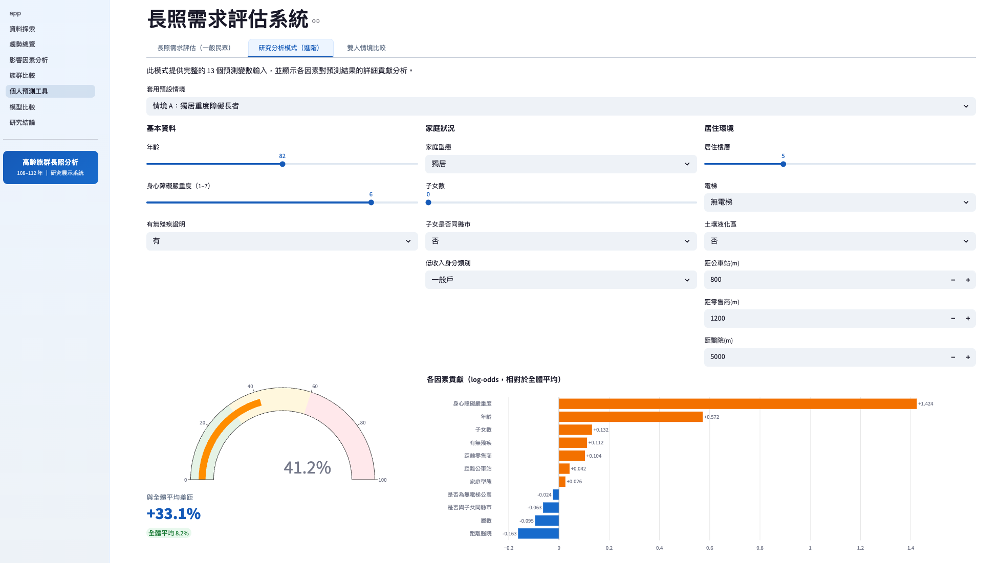
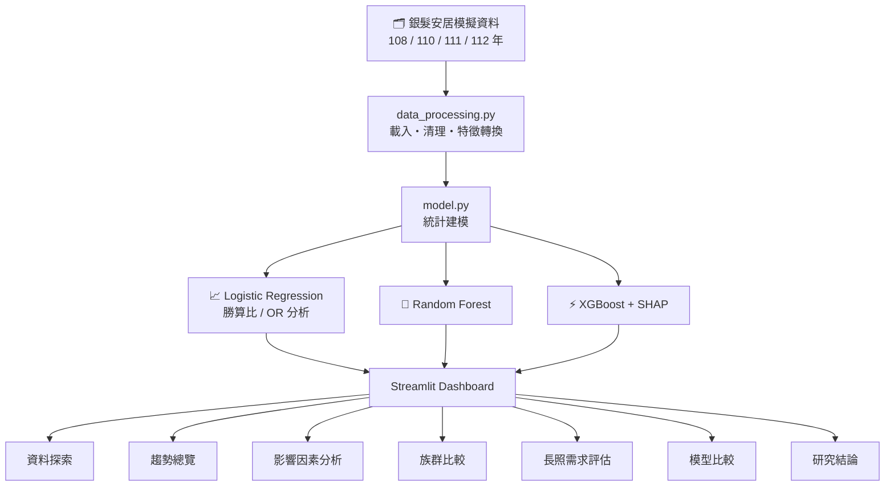

<div align="center">

# 🏥 Elderly LTC Analysis

### 高齡族群長照使用之時間變化與影響因素分析

*An interactive data science dashboard for analyzing long-term care utilization trends among the elderly in Taiwan (2019–2023)*

[](https://www.python.org/)
[](https://streamlit.io/)
[](LICENSE)
[](https://github.com/Yuchen1222/elderly-ltc-analysis/stargazers)

**[🚀 Live Demo](https://elderly-ltc-analysis.onrender.com)** · [🐛 Report Bug](https://github.com/Yuchen1222/elderly-ltc-analysis/issues) · [💡 Request Feature](https://github.com/Yuchen1222/elderly-ltc-analysis/issues)

---

> 📌 Competition entry for **Promenade of Data Science 2025**
> Institute of Statistical Science, Academia Sinica



</div>

---

## 📖 About

台灣已正式邁入超高齡社會，長照服務需求持續攀升，然而**實際使用率與需求之間仍存在顯著落差**。

本專案以民國 108 至 112 年之銀髮安居模擬資料為基礎，結合統計建模與機器學習，建構一套具備互動功能的長照分析系統。系統涵蓋探索性資料分析、邏輯斯迴歸、隨機森林、XGBoost 與 SHAP 可解釋性分析，並以 Streamlit 實作面向一般民眾的**長照需求評估工具**，讓分析結果能直接服務社會。

**核心發現：**
- 長照使用率於民國 **110 年達到高峰（15.9%）** 後逐年下降，顯示供需間存在落差
- **身心障礙嚴重度（OR ≈ 1.61）** 與 **年齡（OR ≈ 1.07）** 為最強正向預測因子
- 低收入族群即使有補助，使用率仍偏低，反映資訊可近性的不平等

---

## ✨ Features

| | 功能 | 說明 |
|---|---|---|
| 📊 | **趨勢總覽** | 108–112 年長照使用率折線圖，含年齡層細分析 |
| 🔍 | **影響因素分析** | 邏輯斯迴歸勝算比（OR）圖，年度 OR 時間趨勢 |
| 👥 | **族群比較** | 五大族群（障礙程度／年齡層／家庭型態等）互動趨勢圖 |
| 🎯 | **長照需求評估** | 一般民眾 5 題快速評估 + 行動建議 + 1966 資源資訊 |
| ⚖️ | **雙人情境比較** | 同時輸入兩個情境，左右比較機率差距與因素貢獻 |
| 🤖 | **模型比較** | LR vs 隨機森林 vs XGBoost，ROC 曲線 + SHAP 解釋 |
| 📋 | **研究結論** | 核心發現、四項政策建議、完整參考文獻 |
| 🔬 | **資料探索** | 變數分佈、箱型圖、皮爾森相關係數矩陣 |

---

## 🚀 Quick Start

```bash
git clone https://github.com/Yuchen1222/elderly-ltc-analysis.git
cd elderly-ltc-analysis
pip install -r requirements.txt
python data/generate_data.py   # 產生模擬資料（只需執行一次）
streamlit run app.py
```

瀏覽器開啟 → http://localhost:8501

---

## 📦 Installation

<details>
<summary><b>macOS / Linux</b></summary>

```bash
python -m venv .venv
source .venv/bin/activate
pip install -r requirements.txt
python data/generate_data.py
streamlit run app.py
```
</details>

<details>
<summary><b>Windows</b></summary>

```bat
python -m venv .venv
.venv\Scripts\activate
pip install -r requirements.txt
python data\generate_data.py
streamlit run app.py
```
</details>

<details>
<summary><b>主要套件版本需求</b></summary>

| 套件 | 版本 |
|------|------|
| streamlit | ≥ 1.28 |
| pandas | ≥ 2.0 |
| statsmodels | ≥ 0.14 |
| scikit-learn | ≥ 1.3 |
| xgboost | ≥ 2.0 |
| shap | ≥ 0.44 |
| plotly | ≥ 5.15 |

</details>

---

## 🏗️ Architecture



**專案結構：**

```
elderly-ltc-analysis/
├── data/
│   ├── generate_data.py          # 模擬資料產生腳本
│   └── angels_simulation_*.csv   # 各年度資料（108/110/111/112）
├── src/
│   ├── data_processing.py        # 資料載入與清理
│   ├── model.py                  # 統計 + ML 模型
│   └── styles.py                 # 共用 CSS 主題
├── pages/                        # Streamlit 多頁面（7 個分析頁面）
├── assets/                       # 截圖與靜態資源
├── .streamlit/config.toml        # 品牌主題設定
├── app.py                        # 首頁
└── requirements.txt
```

---

## ❓ FAQ

<details>
<summary><b>Q1. 為什麼長照使用率在民國 110 年之後下降？</b></summary>

使用率下降**不代表需求減少**。可能原因包含：疫情後服務輸送調整、申請流程障礙、以及服務量能限制。詳見研究結論頁面。
</details>

<details>
<summary><b>Q2. 評估工具的預測機率準確嗎？</b></summary>

方法論（邏輯斯迴歸）與變數選擇均有學術文獻支撐，**方向性關係可信**。但因底層為模擬資料，絕對機率數值僅供參考，不應用於實際臨床決策。正式評估請撥打 **1966 長照服務專線**。
</details>

<details>
<summary><b>Q3. 如何換成真實資料？</b></summary>

將 `data/` 資料夾中的 CSV 替換為真實行政資料，並確保欄位名稱與 `src/data_processing.py` 中的 `RENAME` 對應即可，其餘分析管線不需修改。
</details>

<details>
<summary><b>Q4. 第一次載入模型比較頁面很慢？</b></summary>

頁面首次載入需訓練三個模型（LR / RF / XGBoost），約需 10–15 秒。Streamlit 的 `@st.cache_data` 會快取結果，後續切換頁面不需重新訓練。
</details>

<details>
<summary><b>Q5. 部署到 Render 後第一次開啟很慢？</b></summary>

Render 免費方案在閒置後會進入休眠，首次喚醒需 30–60 秒冷啟動。這是免費方案的正常行為。
</details>

---

## 🤝 Contributing

歡迎任何形式的貢獻！

1. Fork 此 repo
2. 建立功能分支：`git checkout -b feature/your-feature`
3. 提交變更：`git commit -m "Add your feature"`
4. 推送：`git push origin feature/your-feature`
5. 開 Pull Request

---

## 📄 License

本專案採用 [MIT License](LICENSE) 授權。

---

## 👥 Contributors

[](https://github.com/Yuchen1222/elderly-ltc-analysis/graphs/contributors)

---

## 📚 References

- Lin, M. H., Chiu, Y. W., & Lee, C. H. (2021). *Health Policy, 125*(10), 1337–1345.
- 羅玉岱（2011）。*台灣公共衛生雜誌，41*(2)，24–37。
- 廖彩雲、蘇琦雯（2022）。*商管科技季刊，23*(3)，287–319。
- 劉正、齊力（2018）。*國土及公共治理季刊，7*(1)，70–85。
- 丁施丹等（2023）。*長期照護雜誌，26*(1)，75–82。

---

<div align="center">

**Promenade of Data Science 2025**  
Institute of Statistical Science, Academia Sinica

</div>